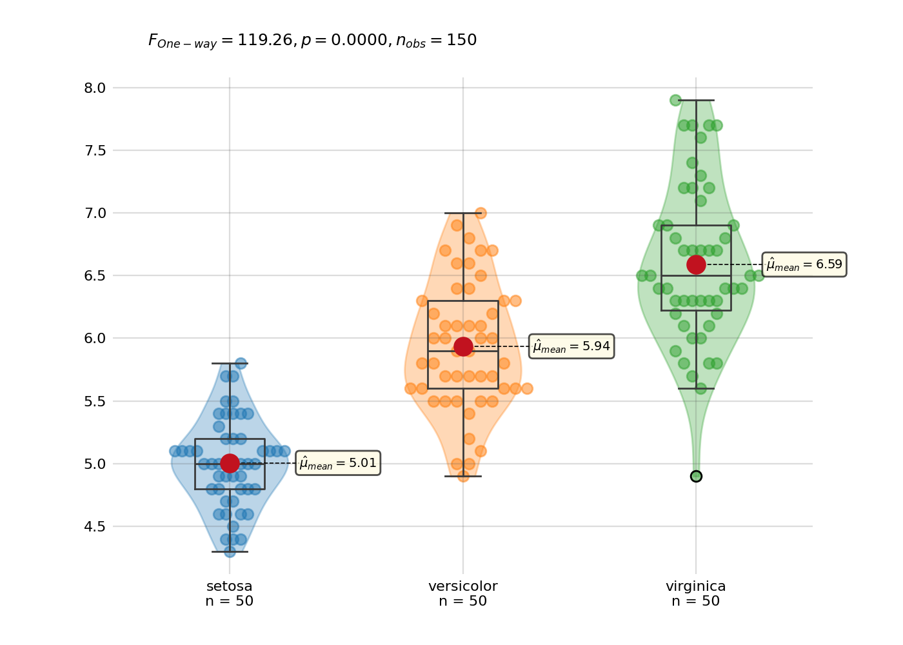

# `fleur`: stats and plots holding hands

<!-- Automatically generated, uses README.qmd to modify README.md -->

`fleur` provides a set of tools to combine data visualization with
statistics.

> fleur is still in a very early stage and in beta version: expect
> regular breaking changes.

[Documentation website](https://y-sunflower.github.io/fleur/)


<br>

## Quick start

### Group comparison

```python
from fleur import BetweenStats
from fleur import data

df = datasets.load_iris()

BetweenStats(df["sepal_length"], df["species"]).plot()
```



### Correlation

```python
from fleur import ScatterStats
from fleur import data

df = datasets.load_iris()

ScatterStats(df["sepal_length"], df["sepal_width"]).plot()
```


<br><br>

## Installation

```bash
pip install fleur
```

<br><br>
