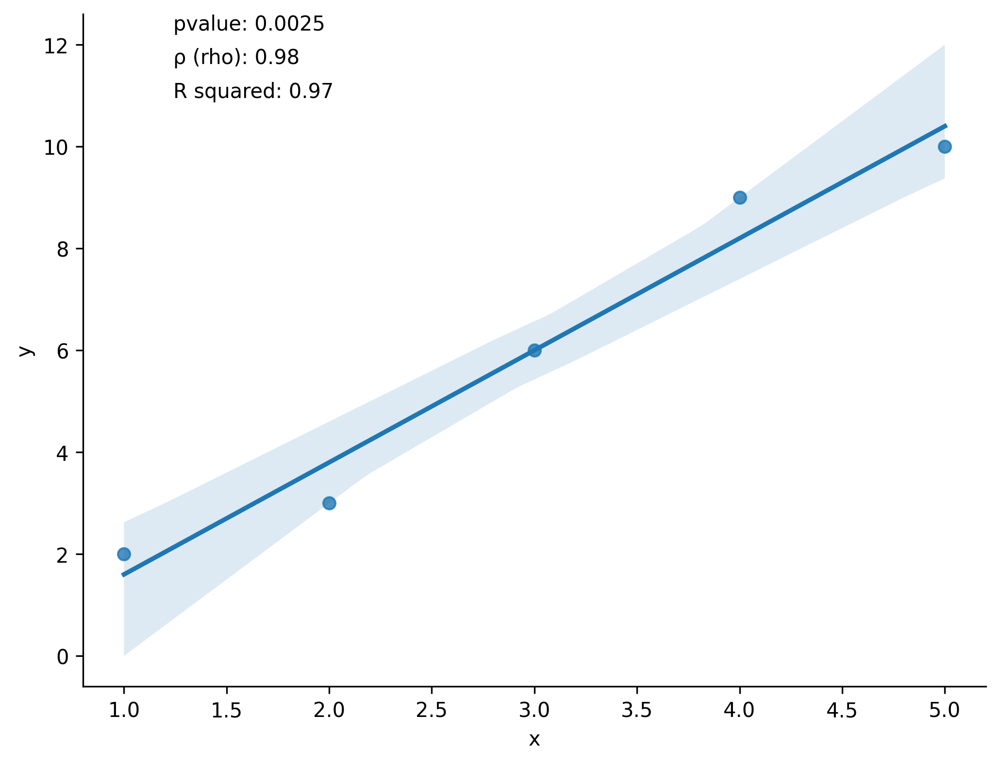

Examples
========

Basic Usage
-----------

.. code-block:: python

    import matplotlib.pyplot as plt
    import numpy as np
    import pandas as pd
    import inferplot

    np.random.seed(42)
    x = np.random.normal(loc=5, scale=10, size=200)
    y = x + np.random.normal(loc=0, scale=5, size=200)
    data = pd.DataFrame({"x": x, "y": y})

    inferplot.scatterstats("x", "y", data, ci=99.9)
    plt.show()

